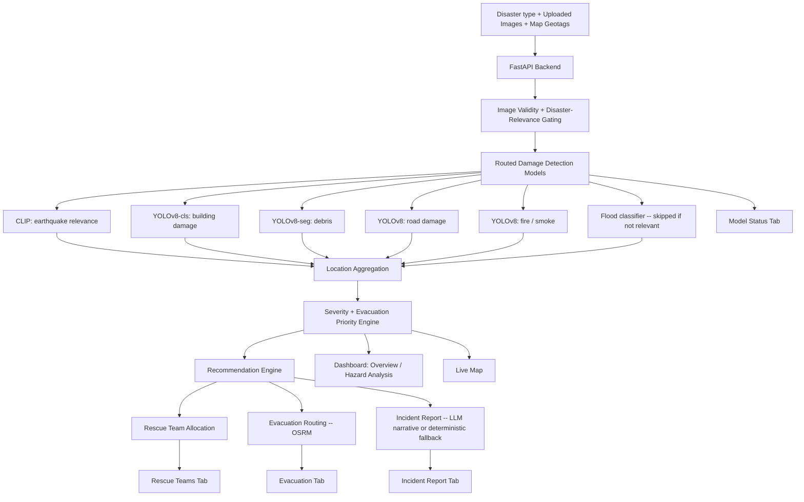

# 🚨 Daring Dicey

### AI-Powered Disaster Assessment & Emergency Response Platform

**Smart India Hackathon 2026 · NITK Surathkal**


Daring Dicey turns raw post-disaster photos into a triaged, ready-to-act
response plan: which locations are damaged, how severe, where to send
rescue teams, what route to take to a safe zone, and a narrated incident
report — end to end, from image upload to exportable report.

> ⚠️ **This is a decision-support tool, not a certified safety system.**
> Every screen in the app carries its own disclaimer, and this README
> repeats them deliberately: AI-detected damage, evacuation priority, and
> routing are automated *estimates* from image evidence only. They do not
> know real-world casualties, population density, hospital capacity, road
> closures, or live conditions. A human must verify before any real
> evacuation or intervention decision.

---

## Table of contents

1. [Problem statement](#1-problem-statement)
2. [Our solution](#2-our-solution)
3. [Key features](#3-key-features)
4. [System architecture](#4-system-architecture)
5. [Technology stack](#5-technology-stack)
6. [Project structure](#6-project-structure)
7. [Data flow](#7-data-flow)
8. [Severity, priority & the model pipeline](#8-severity-priority--the-model-pipeline)
9. [Rescue team allocation](#9-rescue-team-allocation)
10. [Evacuation routing](#10-evacuation-routing)
11. [Incident report](#11-incident-report)
12. [The seven result tabs](#12-the-seven-result-tabs)
13. [Environment variables](#13-environment-variables)
14. [Installation & running locally](#14-installation--running-locally)
15. [Demo workflow](#15-demo-workflow)
16. [Safety & limitations](#16-safety--limitations)
17. [Performance](#17-performance)
18. [Future enhancements](#18-future-enhancements)
19. [Team](#19-team)
20. [License](#20-license)
21. [Acknowledgements](#21-acknowledgements)

---

## 1. Problem statement

After a disaster, emergency teams face the same hard question everywhere:
**where do we go first?**

- A single event can produce dozens of damaged sites at once.
- Response teams and rescue personnel are always limited — you can't send
  everyone everywhere.
- Roads, bridges, and access routes may themselves be damaged, so the
  fastest path on a map isn't always the real fastest path.
- Different disasters produce different kinds of evidence — collapsed
  buildings and structural cracks after an earthquake look nothing like
  flood water or fire damage, so a single generic damage detector isn't
  enough.
- Manual, photo-by-photo assessment doesn't scale under time pressure.

Detecting damage in a photo is the easy part. The actual problem is
turning a pile of geotagged images into an ordered, defensible plan:
*which location is worst, who do we send there, and how do they get
there safely.*

## 2. Our solution

Daring Dicey converts raw disaster evidence into an actionable response
plan through one continuous pipeline:

```
Input: Disaster type + Uploaded images + Map-clicked geotags
        │
        ▼
Image validity gating  (is this even disaster evidence? is it relevant
                         to the selected disaster type?)
        │
        ▼
Disaster-specific AI damage detection  (only the models relevant to the
                                         selected disaster type are run)
        │
        ▼
Location aggregation  (images within a configurable radius are grouped
                        into one location by the backend)
        │
        ▼
Severity & evacuation-priority scoring
        │
        ▼
Deterministic recommendation engine
        │
        ├──► Rescue team allocation (bounded, from your available pool)
        ├──► Evacuation routing (OSRM road-network route to a safe zone)
        └──► LLM-narrated (or deterministic fallback) incident report
        │
        ▼
Dashboard: Overview · Hazard Analysis · Map · Evacuation ·
           Rescue Teams · Recommendations · Incident Report · Model Status
```

The scoring, team allocation, and priority ranking are **deterministic
rule-based logic** — not something an LLM guesses. The LLM's only job (and
only when an API key is configured) is turning that already-computed data
into readable prose for the incident report; without a key, the report
still generates, using deterministic template text instead.

## 3. Key features

### 🧠 Disaster-specific AI damage detection

The backend doesn't run one generic detector on every image — it **routes
to a specific set of models based on the disaster type you select**, and
skips models that aren't relevant. Confirmed model set (from the app's own
Model Status tab):

| Model | What it does |
|---|---|
| **Earthquake relevance** | CLIP zero-shot scene relevance + heuristic regional evidence — not a separately trained model |
| **Building Damage** | Binary damaged/undamaged building classifier (local YOLOv8 classification model) |
| **Debris** | Local YOLOv8 segmentation model, focused by the building-damage region |
| **Road Damage** | Detects road cracks/potholes via a local YOLOv8 object detector |
| **Fire / Smoke** | Local YOLOv8 detector for fire and smoke |
| **Flood** | Whole-image flood classifier — automatically **skipped** ("not run — not relevant") when the selected disaster type doesn't call for it |

A model that isn't relevant is explicitly shown as **skipped**, never as a
false "0 detections" — an error or unavailable dependency is also reported
as skipped rather than silently hidden.

### 📊 Severity & evacuation-priority scoring

Each image goes through: validity gating → disaster-type relevance check
→ specialized detection models → location aggregation → severity
calculation → evacuation-priority ranking. The app is explicit that this
ranking is **based on detected visual damage only** — it does not use or
know real-world population density, road closures, hospital capacity, or
verified safe evacuation routes. Treat it as a triage starting point, not
a routing decision.

### 🗺️ Live map

Built on Leaflet + OpenStreetMap. Used two ways:
- **During upload**, to geotag each image by clicking its real-world
  location (required before analysis can run).
- **In results**, to visualize affected locations and, in the Evacuation
  tab, to draw the actual calculated road route to a safe zone.

A **location cluster tolerance** slider controls how close two uploaded
images' geotags need to be before the backend treats them as the same
location.

### 👥 Rescue team allocation

You enter a total available rescue-member pool (e.g. 500). After
analysis, the backend creates **bounded teams** for disaster-confirmed
locations, prioritized by severity, and reports exactly how many
personnel are allocated versus held in reserve — for example: *"Deploy
Team 1 (50 Urban Search & Rescue members) to Location 1 and Team 2 (50
USAR members) to Location 2. Retain 400 available members in reserve."*
The full pool is never automatically deployed to a single location.

### 🛣️ Evacuation routing

Pick a disaster-confirmed affected location, enter a responder-verified
safe-zone coordinate, and the app calculates a real road-network route
via **OSRM** (default: the public `router.project-osrm.org`, or your own
`OSRM_BASE_URL`). Displays the route on a Leaflet map along with distance
and estimated drive time. The UI itself states this plainly: *routing is
not a live safety guarantee — it does not know current road closures,
flooding, fire lines, traffic, or emergency restrictions.*

### 📑 Incident report

A structured report generated after analysis, covering: disaster type,
overall severity, affected/critical location counts, detected hazards,
model availability, and — if an LLM API key is configured — an
**LLM-generated narrative summary** (executive summary, disaster
assessment, key visual evidence, model confidence/limitations, evacuation
priorities, recommended immediate actions, and an explicit *"Important
Uncertainties"* section listing exactly what the system does **not**
know: casualties, population, infrastructure/services status, and
weather/access conditions). Exportable as a `.txt` file. Without an API
key, the same structure is filled with deterministic text instead of an
LLM narrative.

### 🤖 AI-generated narrative (not an interactive chatbot)

To be precise about what exists today: the LLM integration is a
**one-shot report narrator**, grounded entirely in the already-computed
assessment data (it doesn't invent numbers — it writes prose around the
severity/priority/team figures the deterministic engine already
produced). There is **no interactive chat/Q&A assistant** in the current
app where a user can ask free-form questions about a site. That's listed
under [Future Enhancements](#18-future-enhancements).

## 4. System architecture



## 5. Technology stack

| Layer | Technology | Purpose |
|---|---|---|
| Frontend | React (Vite) | Upload UI, map interaction, results dashboard |
| Backend | FastAPI (Python) | API server, orchestrates the full pipeline |
| AI/ML — vision | PyTorch, Ultralytics YOLOv8 (classification, segmentation, object detection variants) | Building damage, debris, road damage, fire/smoke detection |
| AI/ML — relevance gating | CLIP (zero-shot) | Disaster-type scene relevance check |
| AI/ML — NLP | Hugging Face Transformers | Supporting the narrative-report generation pipeline |
| AI Assistant / Narrative | LLM via `LLM_API_KEY` (provider configurable; optional) | Narrates the incident report from computed data; deterministic text fallback with no key |
| Recommendation engine | Deterministic Python rule engine | Severity/priority scoring, rescue-team allocation |
| Maps | Leaflet + OpenStreetMap | Geotagging, location visualization, route display |
| Routing | OSRM (public instance by default, self-hostable) | Road-network evacuation routes |
| Reports | Backend-generated `.txt` export | Downloadable incident report |

## 6. Project structure

```
daring-dicey/
├── frontend/          React app (Vite) -- Daring Dicey branding
│                       (talks to the backend over HTTP)
└── backend/           FastAPI service
                         - image gating
                         - routed damage-detection models
                         - severity & evacuation-priority scoring
                         - rescue team allocation
                         - evacuation routing (OSRM)
                         - incident report generation (LLM-narrated
                           or deterministic fallback)
```

The backend is sourced from the original `disaster-response-dashboard`
project (logic unchanged); the frontend combines that same app's working
functionality (upload, geotagging, live analysis, all result tabs) with
the visual branding built separately for "Dicey" (light canvas, navy
topbar, orange accent, DM Sans / DM Mono / Fraunces typefaces).

> This README documents what's confirmed working from the project's own
> source `README.md` and a recorded walkthrough of the running app. Exact
> file-level structure inside `frontend/` and `backend/` (route files,
> component layout) isn't enumerated here since those files weren't
> directly provided — see the source tree itself for that level of detail.

## 7. Data flow

```
User
 │
 ▼
Select disaster type
 │
 ▼
Upload images (drag-drop or browse)
 │
 ▼
Click map to geotag each image  ── required before analysis can run
 │
 ▼
Set available rescue-member pool + location cluster tolerance
 │
 ▼
ANALYZE DISASTER
 │
 ▼
Backend: validate images → check disaster-type relevance →
         run only the relevant detection models → aggregate
         locations by geotag proximity → compute severity &
         evacuation priority → generate recommendations,
         team allocation, and incident report
 │
 ▼
Results populate across: Overview, Hazard Analysis, Map, Evacuation,
Rescue Teams, Recommendations, Incident Report, Model Status
```

## 8. Severity, priority & the model pipeline

**Severity** describes how serious the detected physical damage is at a
location (e.g. "CRITICAL" driven by building collapse, fallen structural
elements, roof damage, severe deformation).

**Evacuation priority** ranks locations for response order. The app is
explicit that — as currently implemented — this ranking reflects
**detected visual damage only**. It is a triage starting point for human
responders, not a routing or resource-allocation decision on its own,
and it does not factor in real-world population density, hospital
capacity, or verified safe routes.

The pipeline only runs models relevant to the selected disaster type —
for an earthquake case, the flood classifier is explicitly skipped and
reported as "not relevant to selected disaster type," while the
building-damage, debris, road-damage, and fire/smoke models run. Overall
model availability (e.g. "5/6") reflects how many of the total model set
were applicable and ran successfully for that specific case.

## 9. Rescue team allocation

Input: a total available rescue-member pool.

Output: **bounded teams** assigned to disaster-confirmed locations by
severity/priority, with an explicit reserve count — for example, a
500-person pool might yield two 50-member Urban Search & Rescue teams
deployed to the two highest-priority locations, with 400 held in
reserve. The system never commits the entire pool to a single site.

## 10. Evacuation routing

1. Select a disaster-confirmed affected location.
2. Enter a responder-verified safe-zone / shelter coordinate.
3. The backend calls **OSRM** for a real road-network route (not a
   straight line).
4. The frontend renders the route, distance, and estimated drive time on
   a Leaflet map.

Routing provider defaults to the public `router.project-osrm.org`;
override with `OSRM_BASE_URL` to point at a self-hosted instance. The UI
carries its own explicit caveat: this is route calculation only — it has
no knowledge of live closures, flooding, fire lines, traffic, or
emergency restrictions, and must be verified locally before use.

## 11. Incident report

Generated after analysis, covering:

- Disaster type, overall severity, affected/critical location counts
- Detected hazards and per-model confidence
- Model availability (how many of the model set ran / were relevant)
- Evacuation priority ranking with the reasoning behind each rank
- Recommended immediate actions (including the rescue-team allocation
  decision)
- **An explicit "Important Uncertainties" section** — casualties and
  population figures, infrastructure/utility status, and real-world
  access/weather conditions are all stated as unavailable from the
  provided image data, not silently assumed to be zero risk.

If `LLM_API_KEY` is set, this is written as flowing narrative prose by
the configured LLM, grounded in the already-computed data. Without a key,
the same information is presented as deterministic template text — the
report still generates either way. Exportable via an **Export Report
(.txt)** button.

## 12. The seven result tabs

(Eight tabs total, including Overview — confirmed directly from the
running app.)

| Tab | What it shows |
|---|---|
| **Overview** | Summary cards (affected locations, images analyzed, critical/high-risk counts, model availability), detected hazards, and the top immediate action |
| **Hazard Analysis** | Per-location detected hazard detail |
| **Map** | Upload-time geotagging; result-time location visualization |
| **Evacuation** | Location → safe-zone routing via OSRM, with priority reasoning |
| **Rescue Teams** | Bounded team allocation and reserve count |
| **Recommendations** | Full per-location recommended actions |
| **Incident Report** | Narrated/deterministic structured report + export |
| **Model Status** | Per-model success/skip status and what each model does |

The topbar status pill shows **BACKEND UNREACHABLE** until the frontend
can reach the API, then **SYSTEMS ONLINE**.

## 13. Environment variables

| Variable | Purpose | Required |
|---|---|---|
| `LLM_API_KEY` | Enables LLM-narrated incident report prose | No — falls back to deterministic report text without it |
| `OSRM_BASE_URL` | Points evacuation routing at a self-hosted OSRM instance instead of the public default | No — defaults to `https://router.project-osrm.org` |
| Frontend API base URL (see `frontend/.env.example`) | Tells the frontend where the backend API is running | Yes — defaults to `http://localhost:8000` for local dev |

```env
LLM_API_KEY=your_key_here
OSRM_BASE_URL=https://router.project-osrm.org
```

Never commit real secrets to GitHub — use a local `.env` (already
`.gitignore`d) and keep `.env.example` as the placeholder template.

## 14. Installation & running locally

### Backend

```bash
cd backend
pip install -r requirements.txt
export LLM_API_KEY=your_key      # optional
uvicorn api.server:app --reload --port 8000
```

`torch`, `ultralytics`, and `transformers` are heavy installs, and the
first run also downloads several model weights (YOLO detectors + CLIP) —
expect the first request after startup to be slow while models load. No
API key is required for the core pipeline (detection, severity,
evacuation planning) — only the LLM-narrated incident report needs one.

### Frontend

```bash
cd frontend
npm install
cp .env.example .env    # already points at http://localhost:8000
npm run dev
```

Open the printed local URL. The topbar status pill confirms the backend
connection: CONNECTING → SYSTEMS ONLINE.

## 15. Demo workflow

```text
1. Open the app, pick a disaster type (e.g. Earthquake)
2. Upload site images (drag-drop or browse)
3. Switch to the Map tab, click a location for each image (required)
4. Set the available rescue-member pool and location cluster tolerance
5. Hit ANALYZE DISASTER
6. Review Overview -- affected locations, severity, top immediate action
7. Review Hazard Analysis for per-location detected damage
8. Open Rescue Teams -- see the bounded allocation + reserve count
9. Open Evacuation -- pick a location, enter a safe-zone coordinate,
   calculate the OSRM route
10. Open Incident Report -- read the narrated summary, export as .txt
11. Open Model Status -- see exactly which models ran, which were
    skipped, and why
```

A judge watching this end to end sees: real image upload → real
geotagging → a live multi-model detection pipeline that visibly adapts
to the selected disaster type → a bounded, defensible team-allocation
decision → a real road-network evacuation route → a report that is
upfront about what it doesn't know.

## 16. Safety & limitations

- AI-detected damage, severity, and evacuation priority are
  **decision-support estimates from image evidence only** — they do not
  replace a qualified structural engineer or emergency authority's
  judgment.
- The system does not, and should not be used to, certify that any
  structure is safe.
- Evacuation priority reflects **visual damage only** — it does not know
  real-world population density, hospital capacity, road closures, or
  verified safe evacuation routes.
- Missing or unavailable data (casualties, population, infrastructure
  status, weather) is explicitly reported as *unknown*, never silently
  treated as zero risk — the incident report's "Important Uncertainties"
  section exists specifically for this.
- Evacuation routes are road-network calculations only, with no
  awareness of live closures, flooding, fire lines, traffic, or
  emergency restrictions — verify locally before directing anyone.
- Human verification is required before any critical intervention based
  on this system's output.

## 17. Performance

Performance metrics (detection accuracy, precision/recall, mAP) are
currently being evaluated. No benchmark numbers are published in this
README because none were available to verify at the time of writing.

## 18. Future enhancements

*(Clearly future work — not implemented today.)*

- Interactive AI Q&A assistant (ask free-form questions about a specific
  site, grounded in that site's assessment data)
- Real-time satellite or drone feed integration
- Verified, live population/census data instead of image-evidence-only
  priority
- Live road-closure and traffic data feeding into evacuation routing
- Real-time rescue-team location tracking
- Weather and IoT sensor integration
- Multi-disaster fusion for compound events
- Offline-first field operation mode
- Native mobile application

## 19. Team

```
Daring Dicey
Smart India Hackathon 2026
NITK Surathkal
```

## 20. License

License information will be added.

## 21. Acknowledgements

- [Ultralytics YOLOv8](https://github.com/ultralytics/ultralytics) — damage/hazard detection models
- [OpenAI CLIP](https://github.com/openai/CLIP) — zero-shot disaster-relevance scene classification
- [Hugging Face Transformers](https://github.com/huggingface/transformers)
- [OSRM](https://project-osrm.org/) — open-source road-network routing
- [Leaflet](https://leafletjs.com/) + [OpenStreetMap](https://www.openstreetmap.org/) contributors — mapping
- [FastAPI](https://fastapi.tiangolo.com/) · [React](https://react.dev/) · [Vite](https://vitejs.dev/)

---

*The AI never certifies repairs or safety — qualified personnel and
emergency authorities make the final call.*
